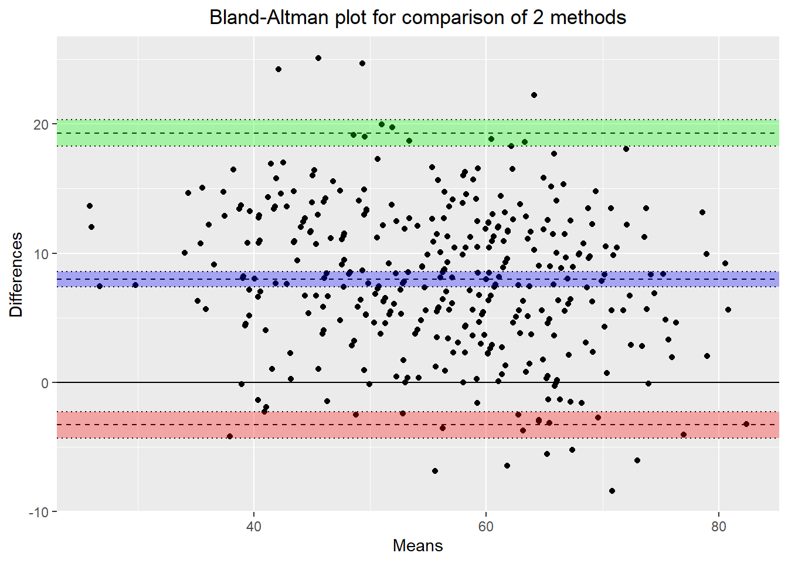

É a largura total do intervalo de confiança (limite superior menos limite inferior).

Quanto menor seu valor maior será a precisão da estimativa, porém o tamanho de amostra necessário também será maior.

A amplitude do intervalo de confiança são para os limites de concordância, representadas pelas áreas verdes e vermelhas do gráfico abaixo:

